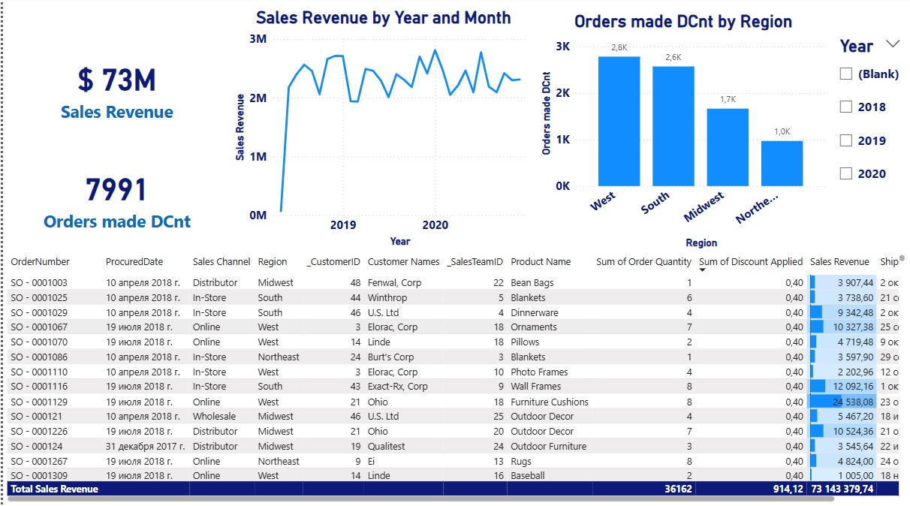

# 📦 Logistics Dashboard – Power BI Project

A Power BI project showcasing key logistics and sales metrics across three report pages.

---

## 📊 Page 1: General Sales Overview

A baseline dashboard displaying overall performance:

- **Total Sales Revenue** and **Total Orders**
- **Sales Revenue by Year and Month**
- **Orders by Region**
- **Detailed table view** of all orders
- **Year slicer** for dynamic filtering

---

## 🎯 Page 2: Discounted Sales (≥10%) and Online Orders

A focused report page for analyzing transactions with significant discounts:

- **All visuals filtered** to show only sales with **≥10% discount**
- **Card visual** displaying the **total sales value from online orders**
- **Synchronized year slicer** for consistency across visuals

---

## 🚚 Page 3: Logistics Team Report

Designed for a logistics manager to monitor operational aspects:

- **Top 10 Most Ordered Products** (bar chart)
- **Order Distribution by Region** (pie chart)
- **Orders by Quarter** (horizontal bar chart showing seasonal trends)
- **Average Order Processing Time** (days between OrderDate and ShipDate) by top products

---

## ⚙️ Tools & Technologies
- Power BI Desktop
- DAX Calculations
- Data Modeling
- Custom columns & filters

## 📁 Files
- `.pbix` file with complete interactive dashboard
- Screenshots from each page
- README documentation

## 🔍 Key Insights
- Region **West** leads in order volume.
- Highest order activity in **Q3 and Q4**.
- **Platters**, **Serveware**, and **Cocktail Glasses** are among the most frequently ordered products.
- Average order processing time ranges from **16 to 17 days** for top products — indicating room for optimization.

## 💬 Author
Olena Avramenko  
[LinkedIn Profile](https://www.linkedin.com/in/o-avramenko/)

